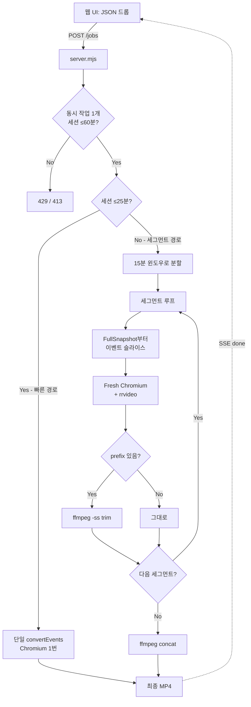
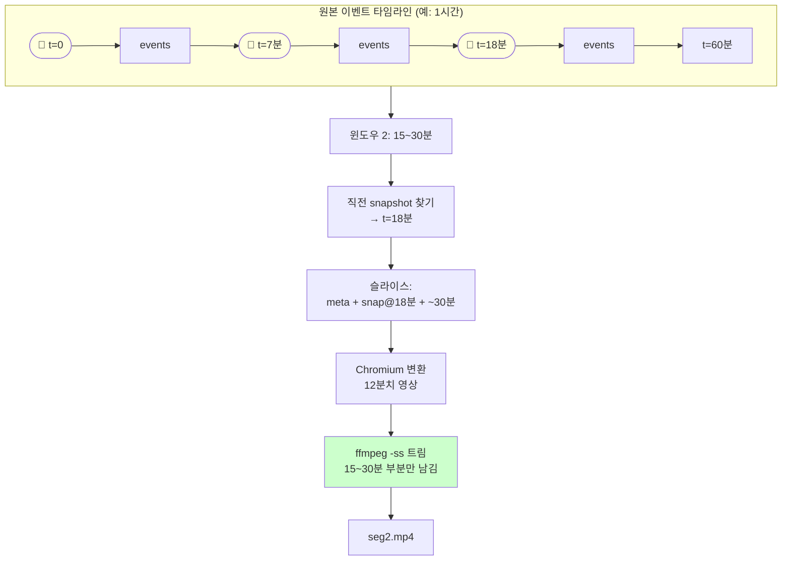

# tapelay

[English](./README.md)

Sentry replay JSON(rrweb) → MP4 변환기. 백엔드는 Sentry 팀 공식 도구인
[`@rrweb/rrvideo`](https://www.npmjs.com/package/@rrweb/rrvideo)
(Playwright + rrweb 기반)을 그대로 사용. 위에 드래그앤드롭 웹 UI만 얹은 형태.

## Sentry 리플레이 URL 로 바로 변환

```bash
export SENTRY_AUTH_TOKEN=...   # Settings > Account > User Auth Tokens (project:read)
npx tapelay https://acme.sentry.io/replays/<id>/ bug-1234.mp4 --from 4:20 --to 4:50
```

Sentry 에서 리플레이 URL 을 복사해서 넣으면 `/recording-segments/` API 로 이벤트를
직접 받아옵니다. JSON 을 손으로 빼내는 공식 방법이 없기 때문에, 사실상 이게 유일한 경로입니다.

`--from` / `--to` 는 초 또는 `m:ss` 를 받습니다. 티켓에 붙이는 건 보통 전체 세션이 아니라
에러 앞뒤 30초이고, 그만큼만 뽑으면 변환도 분 단위에서 초 단위로 줄어듭니다.
URL 에 Sentry 의 `?t=` 재생 위치가 있으면 그게 `--from` 기본값이 됩니다.

단, rrweb 은 FullSnapshot 에서만 재생을 시작할 수 있어서 클립은 직전 스냅샷부터
렌더한 뒤 잘라냅니다. 변환 비용은 클립 길이가 아니라 직전 스냅샷까지의 거리에 비례합니다.

모든 변환은 로컬에서 일어나고, 리플레이 데이터는 어디에도 업로드되지 않습니다.

## 설치

```powershell
npm install
```

`@rrweb/rrvideo`가 Playwright를 끌어오고, `postinstall` 훅이 Chromium(~150MB)을 자동으로 받습니다.

## 1. 웹 UI

```powershell
npm start
```

브라우저로 [http://localhost:3000](http://localhost:3000) → JSON 드롭 → 자동 변환·다운로드.

옵션:
- **비디오 재생 속도** (1x ~ 16x) — 결과 MP4가 몇 배속으로 재생될지. 변환 시간도 같이 줄어듦.
- **해상도** (50% / 75% / 100%)


옵션:

| 옵션 | 기본 | 설명 |
|------|------|------|
| `--speed N` | 4 | 비디오 재생 속도 (= rrweb 내부 재생 배속) |
| `--scale N` | 0.75 | 해상도 배율 (0.25 ~ 1) |

```powershell
node convert.mjs replay.json out.mp4 --speed 1 --scale 1
```

## 변환 시간 (1시간 세션 기준)

배속 = 결과 MP4 재생 속도이자 변환 시 rrweb 재생 속도. 둘은 같이 움직임 — 4x로 변환하면 결과도 4배속.

| 옵션 | 변환 시간 | 결과 길이 |
|------|-----------|-----------|
| `--speed 1` | 약 1시간 | 1시간 |
| `--speed 2` | 약 30분 | 30분 |
| `--speed 4` (기본) | 약 15분 | 15분 |
| `--speed 8` | 약 7분 | 7분 |
| `--speed 16` | 약 4분 | 4분 |

`@rrweb/rrvideo`는 Playwright 내장 video recording을 사용해 세션 길이만큼 실제로 재생하면서 녹화합니다. 따라서 1x 부드러운 변환은 본질적으로 세션 길이만큼 시간이 듭니다 (rrvideo든, 다른 어떤 헤드리스 도구든 동일).

## 동작 방식

### 전체 변환 파이프라인

세션 길이에 따라 두 경로로 분기됩니다.

- **세션 ≤ 25분** → 단일 변환 (Chromium 1번 부팅, 가장 빠름)
- **세션 > 25분** → 15분 윈도우 단위 세그먼트 변환 (메모리 안전)



### 출력 코덱 (H.264 인코딩)

Playwright 녹화기는 출력 파일명을 `.mp4`로 줘도 실제로는 **VP8/WebM**을 씁니다.
그래서 `rrvideo` 결과를 그대로 쓰면 QuickTime, PowerPoint, iOS에서 열리지 않습니다.
비개발자에게 보내는 게 목적인 도구라 이건 치명적이라, 모든 경로의 마지막에
`libx264 + yuv420p + faststart`로 인코딩합니다. `--no-transcode`로 끌 수 있지만
그러면 확장자만 mp4인 WebM 파일이 나옵니다.

### 왜 임계값을 두는가

세그먼트 변환은 Chromium 콜드 부팅(~3초) + rrvideo 초기화가 윈도우마다 반복되므로,
짧은 세션은 **세그먼트로 쪼개면 오히려 느려집니다**. 25분 이하면 단일 변환이 빠르고
메모리도 견딜 만하므로 빠른 경로로 갑니다.

### 세그먼트 슬라이싱 (왜 trim이 필요한가)

각 윈도우는 rrweb 재생을 위해 직전의 `FullSnapshot(type=2)`부터 이벤트를 포함시켜야 합니다.
그래서 변환된 영상 앞쪽에 윈도우 밖의 prefix가 붙고, 이걸 `ffmpeg -ss`로 잘라낸 뒤 concat합니다.

트림 길이를 이벤트 타임스탬프로 계산하면(`(winStart - snapshotTs) / speed`) 1초 안팎 어긋납니다.
Chromium이 녹화를 시작한 뒤 실제 재생이 시작되기까지의 리드인을 알 수 없기 때문입니다.
우리가 원하는 구간은 항상 클립의 뒤쪽이므로, 렌더된 파일 길이에서 역산하면 정확합니다.

```
trimSec = 실제_클립_길이 - (윈도우_길이 / speed)
```

또한 VP8 상태로 `-c copy` 트림을 하면 키프레임 단위로만 잘리므로, 세그먼트마다
트림과 H.264 인코딩을 한 번에 처리하고 마지막 concat만 `-c copy`로 끝냅니다.



세그먼트마다 **Chromium이 완전히 재시작**되므로 메모리는 한 윈도우 분량으로 한정됩니다. 덕분에 1GB RAM 환경(Railway Trial 등)에서도 30분~60분 세션이 가능합니다.

## 파일 구조

```
core.mjs        # convertEvents (단일) + convertEventsSegmented (세그먼트)
server.mjs      # Express 서버 + SSE 진행률 + 가드
convert.mjs     # CLI 진입점
Dockerfile      # Playwright 1.60 + ffmpeg (Railway 배포용)
public/
  └── index.html  # 드롭존 + 컨트롤 + 진행률 UI
```

## 문제 해결

- **`postinstall`에서 Chromium 다운로드 실패** → 수동 실행: `npx playwright install chromium`
- **포트 3000 충돌** → `set PORT=4000 && npm start`
- **빈 영역/깨진 폰트** → 원본 페이지의 CORS 차단 리소스. rrweb 한계.
- **메모리 부족** → `node --max-old-space-size=8192 server.mjs`
