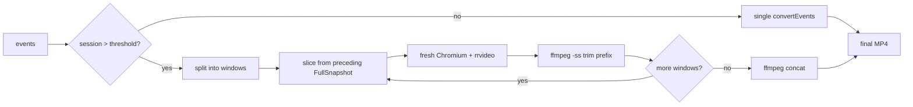

# tapelay

Convert an rrweb session recording into an MP4 you can attach to a ticket, drop in a Slack thread, or show to someone who does not have a replay viewer.

Works with Sentry and PostHog replay exports out of the box, and converts hour-long sessions without running out of memory.

[한국어 문서](./README.ko.md)

## Why

[`rrvideo`](https://www.npmjs.com/package/rrvideo) already renders rrweb events to video, and this package uses it underneath. Two things sit on top of it:

1. **Input normalization.** `rrvideo` wants a bare rrweb event array. What you actually download from Sentry or PostHog is a wrapper object, often with the events nested under `events`, `segments`, or `data`, sometimes split across several segment files. This unwraps and merges them for you.
2. **Long sessions.** `rrvideo` replays the whole session in one Chromium instance, so a one-hour recording exhausts memory before it finishes. This splits the session into windows, converts each in a fresh browser, and stitches the pieces with ffmpeg. A 60-minute session converts in 1 GB of RAM.
3. **A file that actually opens.** Playwright's recorder emits VP8 in a WebM container no matter what you name the output, so a `.mp4` from a plain `rrvideo` run will not open in QuickTime, PowerPoint or on iOS. Everything here is encoded to H.264 with `yuv420p` and `+faststart`, which is the point when you are sending it to someone who is not a developer.

## Quick start

From a Sentry replay URL, which is usually where you are when you need this:

```bash
export SENTRY_AUTH_TOKEN=...   # Settings > Account > User Auth Tokens, project:read scope
npx tapelay https://acme.sentry.io/replays/<id>/ bug-1234.mp4 --from 4:20 --to 4:50
```

Copy the replay URL out of Sentry, name the output, drag it into the ticket. You never have to work out how to export the JSON, because there is no documented way to do it by hand.

From a file you already have:

```bash
npx tapelay replay.json
```

That writes `replay.mp4` next to the input.

## Clip a range

`--from` and `--to` take seconds or `m:ss`. Sentry tells you the second the error happened, and what belongs in a ticket is the thirty seconds around it, not the whole hour:

```bash
npx tapelay replay.json --from 4:20 --to 4:50
```

This also sidesteps the conversion time problem: a 30-second clip takes seconds, where the full session takes minutes. If the replay URL carries Sentry's `?t=` playback position, that becomes the default `--from`, so pausing at the error before you copy the URL is enough.

One caveat: rrweb can only start replaying from a full DOM snapshot, so a clip is rendered from the nearest snapshot before your start point and then trimmed. Conversion cost tracks the distance back to that snapshot, not the length of the clip.

## Privacy

Everything runs on your machine. The replay is fetched from your own Sentry org with your own token, converted locally, and written to a local file. Nothing is uploaded anywhere, which is the point when the recording contains real user sessions.

## Web UI

```bash
npx tapelay serve
```

Open http://localhost:3000 and the whole flow is on one page: sign in, browse the replays in your org, pick the range around the error, convert. The second tab takes an rrweb JSON file by drag and drop instead. Progress streams over SSE; `--port` changes the port.

Signing in usually takes no setup: if `sentry-cli` is already configured on the machine, its token in `~/.sentryclirc` is used and the connect screen never appears. Otherwise there is a **Sign in with Sentry** button (OAuth device flow — it needs `SENTRY_CLIENT_ID` from a public integration in your org, and Sentry 26.1.0+), or you can paste a user auth token with the `project:read` scope. See [docs/guide/gui.md](docs/guide/gui.md) for the details.

## Options

| Option | Default | Description |
|---|---|---|
| `--speed <n>` | `4` | Playback speed of the result, 1 to 16. This is also the replay speed during conversion, so a higher value finishes sooner and produces a shorter video. |
| `--scale <n>` | `0.75` | Resolution ratio, 0.25 to 1. |
| `--segment <min>` | `15` | Window size for segmented conversion. |
| `--threshold <min>` | `25` | Sessions shorter than this convert in a single pass. |
| `--no-segment` | | Never segment. Faster for short sessions, and likely to run out of memory on long ones. |
| `--no-transcode` | | Skip H.264 encoding and keep Playwright's raw VP8/WebM. Only useful if you have no ffmpeg and something downstream can read WebM. |

## Conversion time

Conversion is a real-time replay, so a 1x conversion takes about as long as the session itself. This is inherent to how rrweb is rendered to video, not specific to this tool.

| Speed | 1-hour session takes | Result length |
|---|---|---|
| `--speed 1` | ~60 min | 60 min |
| `--speed 2` | ~30 min | 30 min |
| `--speed 4` (default) | ~15 min | 15 min |
| `--speed 8` | ~7 min | 7 min |
| `--speed 16` | ~4 min | 4 min |

## How segmented conversion works

Below the threshold, the session is converted in one pass: one Chromium boot, fastest path.

Above it, the session is cut into windows. The complication is that you cannot start replaying rrweb from an arbitrary timestamp. A window must begin at a `FullSnapshot` (`type: 2`), because that is the only event carrying the complete DOM. So each window is sliced from the nearest preceding snapshot, which means the rendered clip starts earlier than the window does. That extra head is trimmed off with `ffmpeg -ss` before the segments are concatenated.

The obvious way to size that trim is from the event timeline, `(windowStart - snapshotTimestamp) / speed`. That is off by a second or so, because it cannot see the lead-in between Chromium starting to record and the replay actually beginning. Since the part you want is always the tail of the clip, measuring the rendered file is exact and self-correcting:

```
trimSeconds = actualClipDuration - (windowDuration / speed)
```

Each window gets a fresh Chromium process, so peak memory is bounded by one window instead of the whole session.



## Use as a library

```js
import { normalizeEvents, convertEventsSegmented } from 'tapelay'

const events = normalizeEvents(JSON.parse(await readFile('replay.json', 'utf8')))

await convertEventsSegmented({
  events,
  outPath: 'out.mp4',
  speed: 4,
  scale: 0.75,
  segmentMs: 15 * 60 * 1000,
  onProgress: ({ percent }) => console.log(percent),
})
```

`convertEvents` is the single-pass version with the same option shape, minus the segment settings.

## Requirements

- Node 18 or newer
- **Chromium**, installed by Playwright. `rrvideo` pulls in Playwright and its postinstall downloads Chromium (~150 MB) the first time. If that step was skipped, run `npx playwright install chromium`.
- **ffmpeg** (with `ffprobe`) on `PATH`, used for the H.264 encode and for trimming and concatenating segments. macOS: `brew install ffmpeg`. Debian/Ubuntu: `apt install ffmpeg`. You can skip it with `--no-transcode` on a short session, at the cost of getting a WebM file named `.mp4`.

## Troubleshooting

| Symptom | Cause |
|---|---|
| `Playwright Chromium is not installed` | The postinstall was skipped. Run `npx playwright install chromium`. |
| `ffmpeg is not on PATH` | Install ffmpeg, or pass `--no-segment` for a short session. |
| Blank areas or missing fonts in the video | The original page loaded those assets from an origin that blocks them at replay time. This is an rrweb limitation, not something this tool can recover. |
| Out of memory | Lower `--segment`, or raise the heap: `node --max-old-space-size=8192`. |
| `Timeout exceeded ... setting frame content` | An occasional flake from `rrvideo` when Chromium is slow to start. Re-run. |

## License

MIT
